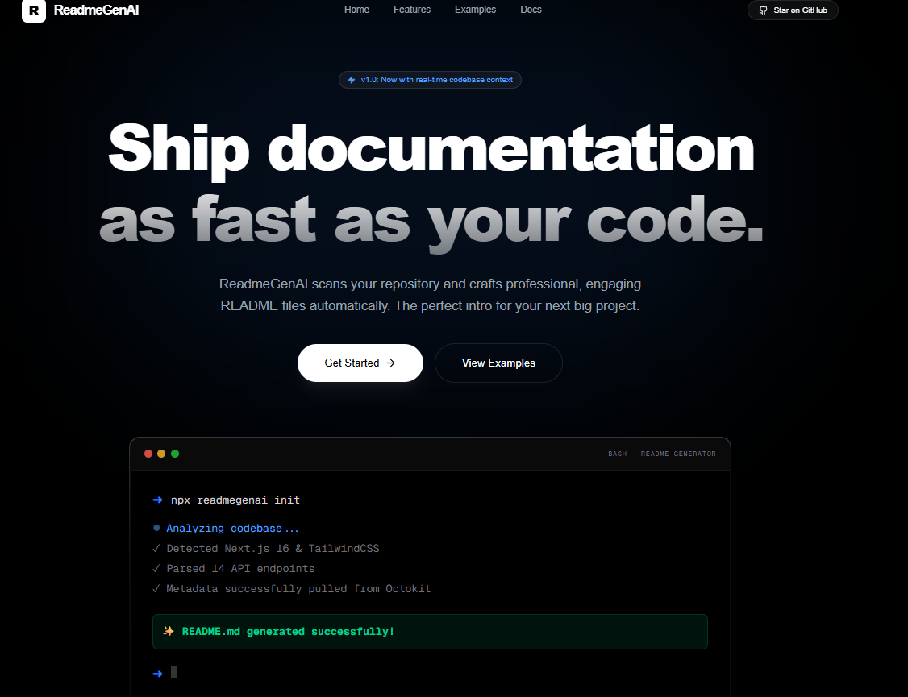

# ReadmeGenAI

[English README](README.md) · Dansk dokumentation

ReadmeGenAI hjælper dig med at oprette et README-udkast til et GitHub-projekt. Indsæt projektets HTTPS-adresse, vælg sprog, og gennemse resultatet, før du kopierer eller henter Markdown-filen. **Danish** kan vælges i sprogmenuen for at få AI-modellen til at skrive på dansk. Engelsk er fortsat standardsprog i brugerfladen og for nye genereringer.



## Funktioner

- Opretter et Markdown-udkast ud fra projektoplysninger fra GitHub.
- Understøtter offentlige projekter og private projekter med GitHub-login og særskilt samtykke.
- Lader dig vælge sprog, forhåndsvise, kopiere og hente resultatet.
- Gemmer tidligere genereringer lokalt i browseren på den aktuelle enhed.

AI-genereret dokumentation kan indeholde fejl. Kontrollér især installationskommandoer, licens, funktioner og påstande om sikkerhed, før du offentliggør filen.

## Teknologi

Projektet bruger Next.js, React og TypeScript. GitHub-data hentes via Octokit, og AI-genereringen bruger Google Gemini. Se `package.json` for de konkrete afhængigheder.

## Lokal installation

Du skal bruge Node.js og npm samt dine egne nøgler til Google Gemini og GitHub OAuth.

```bash
git clone https://github.com/BeyteFlow/ReadmeGenAI.git
cd ReadmeGenAI
npm ci
```

Opret `.env.local` i projektets rodmappe med dine egne værdier:

```dotenv
GEMINI_API_KEY=din_gemini_nøgle
GITHUB_CLIENT_ID=dit_github_client_id
GITHUB_CLIENT_SECRET=din_github_client_secret
NEXTAUTH_SECRET=en_lang_tilfældig_hemmelighed
NEXTAUTH_URL=http://localhost:3000
```

Indstil callback-adressen for din GitHub OAuth-app til `http://localhost:3000/api/auth/callback/github`. Læg aldrig `.env.local` eller dine nøgler på GitHub.

Start udviklingsserveren:

```bash
npm run dev
```

Åbn [http://localhost:3000](http://localhost:3000). Selve README-genereringen kræver adgang til GitHub og Google Gemini.

## Private projekter

Ved private GitHub-projekter beder appen om login og særskilt samtykke, før projektets metadata og filnavne fra rodmappen sendes til AI-modellen. Kontrollér, at dette passer til projektets fortrolighedskrav, før du fortsætter.

## Bidrag og licens

Fork projektet, lav en gren til ændringen, og opret en Pull Request til originalprojektet. Se [engelsk README](README.md) og [adfærdskodeks](CODE_OF_CONDUCT.md). Projektet er udgivet under [MIT-licensen](LICENSE); behold licens- og ophavsretsoplysninger ved videre distribution.
